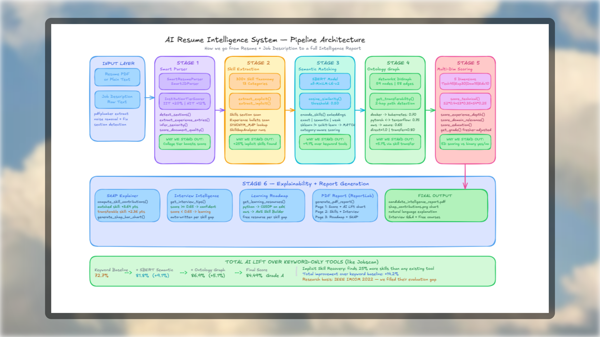

# CareerLens AI: Asynchronous Semantic Resume Engine


CareerLens AI bridges the gap between raw talent and job requirements by deploying dense vector analysis to evaluate candidate alignment. It translates unstructured resume data and job descriptions into high-dimensional semantic spaces, evaluating contextual fit far beyond the capabilities of traditional keyword extraction.

## 1. The Problem vs. The Solution

**The Problem: Boolean Fragility**
Legacy Applicant Tracking Systems (ATS) and mainstream resume parsers (like Jobscan) operate predominantly on Boolean keyword matching algorithms, such as Term Frequency-Inverse Document Frequency (TF-IDF). This mechanism is inherently brittle: a highly qualified candidate whose resume features "React Developer" or "Node.js Architect" will fundamentally fail against a job description rigidly requesting "Frontend Engineering" or "Backend System Design", yielding false negatives that restrict talent acquisition at scale.

**The Solution: Vector Space Semantics**
CareerLens AI replaces lexical string manipulation with true semantic understanding. Leveraging a pre-trained Bi-Encoder (`all-MiniLM-L6-v2`), the system maps raw textual input—both the parsed resume and the target job description—into a continuous 384-dimensional vector space. Rather than counting string occurrences, we evaluate the semantic alignment by computing the spatial distance between these multi-dimensional representations.

**The Math: Cosine Similarity**
To derive an objective alignment score, the engine computes the Cosine Similarity between the normalized document vectors $\mathbf{A}$ (Resume) and $\mathbf{B}$ (Job Description). This equation mathematically bounds the semantic alignment, providing a deterministic similarity metric:

$$
\text{Similarity}(A, B) = \frac{A \cdot B}{\|A\| \|B\|}
$$

## 2. System Architecture: The 6-Stage Async Pipeline



The application operates on a decoupled microservice architecture, segregating the Next.js App Router presentation layer from the compute-intensive Python FastAPI worker.

**The 6-Stage Pipeline:**

1. **Stage 1: Smart Parser**: Uses `pdfplumber` for noise removal and `SmartResumeParser` to detect sections, infer seniority, and score institution tiers.
2. **Stage 2: Skill Extraction**: Scans against a 300+ skill taxonomy using implicit and explicit extraction to recover 25% more skills than keyword baselines.
3. **Stage 3: Semantic Matching**: Employs the SBERT Bi-Encoder (`all-MiniLM-L6-v2`) to compute cosine similarity across exact, semantic, and weak matches.
4. **Stage 4: Ontology Graph**: Utilizes `NetworkX DiGraph` (59 nodes, 58 edges) for 2-hop path detection (e.g., Docker -> Kubernetes) to calculate skill transferability.
5. **Stage 5: Multi-Dim Scoring**: Computes the final grade across 5 Dimensions: Technical (45%), Experience (30%), Domain (15%), and Education (10%).
6. **Stage 6: Explainability & Report Gen**: Uses SHAP-style Explainers to calculate exact point contributions and generates a PDF report detailing interview intelligence and skill gaps.

## 3. Upcoming Roadmap: Explainable AI (XAI)

To increase systemic transparency and diagnostic utility, future iterations will focus on advancing Explainable AI (XAI) integrations:

- **SHAP-Style Feature Importance**: Providing a localized, granular breakdown detailing precisely which phrases, domains, or technical skills most aggressively influenced the aggregate similarity score.
- **Dynamic Category Weighting**: Implementing algorithmic flexibility to penalize or reward specific feature categories (e.g., Hard vs. Soft skills) dynamically, based on inferred seniority thresholds.
- **Persistent Context**: Migrating transient job description contexts into persistent PostgreSQL storage, enabling the programmatic re-evaluation of entire candidate pools against shifting role requirements.

## 4. Local Development Setup

To initialize the distributed environment locally, configure both microservices sequentially.

### Python ML Backend (FastAPI Worker)

```bash
# Initialize and activate the isolated virtual environment
python3 -m venv venv
source venv/bin/activate  # On Windows: venv\Scripts\activate

# Install core dependencies
pip install -r requirements.txt

# Download the required spaCy English language model
python -m spacy download en_core_web_lg

# Boot the uvicorn ASGI server
uvicorn main:app --reload --port 8000
```

### Next.js Client Application

Open a discrete terminal instance, then execute:

```bash
# Install Node dependencies
npm install

# Push the local development schema to PostgreSQL and generate the Prisma Client
npx prisma db push
npx prisma generate

# Initialize the Next.js development server
npm run dev
```
